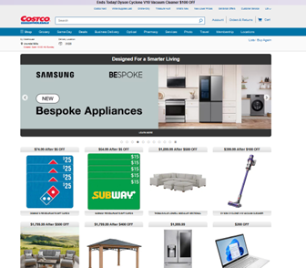
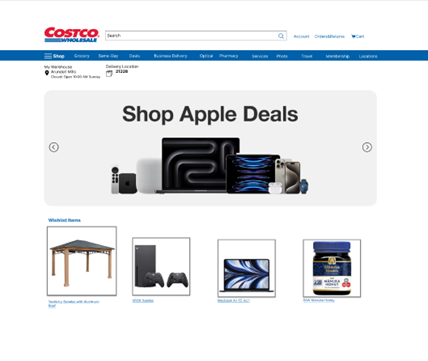
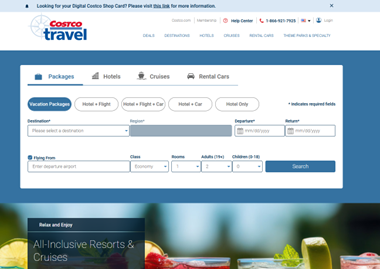
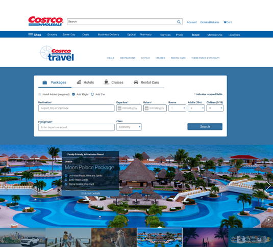

# Costco.com UX Redesign – Wishlist, Navigation & Password Reset

**Role:** UX Designer / Researcher  
**Duration:** 3 weeks · **Tools:** Figma, heuristic evaluation, cognitive walkthroughs

Redesign of key Costco.com flows (wishlist, travel navigation, password reset) to fix
inconsistencies, reduce friction, and better match user expectations on a modern e-commerce site.

## Summary

- **Problem:** Costco.com’s navigation, account flows, and shopping support features (wishlist, recently viewed, grocery categories)
  showed major usability issues (inconsistent nav, missing “Recently Viewed”, poor error feedback, misaligned grocery categories). :contentReference[oaicite:6]{index=6}
- **What I did:** Ran heuristic evaluations and interviews, designed lo-fi and mid-fi prototypes
  for wishlist/recently viewed, Costco Travel navigation, and password reset (desktop + mobile),
  then validated with cognitive walkthroughs and user feedback. :contentReference[oaicite:7]{index=7}
- **Outcome:** Clearer navigation, more efficient wishlist discovery, improved password reset feedback,
  and concrete recommendations around dynamic feedback and better mobile scaling. :contentReference[oaicite:8]{index=8}

## Context & Goals

Costco.com is functional but outdated compared to modern e-commerce patterns. User feedback and heuristic
evaluation showed that:

- Navigation behaved inconsistently (e.g., Costco Travel using a different nav pattern).
- Core e-commerce affordances like “Recently Viewed” were missing.
- Error messages in flows like password reset were vague or unhelpful.
- Grocery categories didn’t match users’ mental models due to Instacart integration.

**Goal:** Improve key flows (wishlist/recently viewed, travel navigation, password reset) to reduce friction,
align with users’ expectations, and make the site feel more modern without changing Costco’s brand foundations.

## Research & Heuristic Evaluation

I ran a heuristic evaluation and analyzed user reports/interviews. The most critical issues:

1. **Inconsistent navigation (Costco Travel)**  
   - The Travel section used a different layout and removed the global nav, forcing users to use the
     browser back button instead of consistent site navigation. (Consistency & standards) :contentReference[oaicite:11]{index=11}  

2. **No “Recently Viewed” support**  
   - Users had to rely on memory or browser history to revisit products; there was no native recently-viewed
     section, unusual for modern e-commerce. (Recognition rather than recall) :contentReference[oaicite:12]{index=12}  

3. **Unclear error handling in password reset**  
   - Entering a non-existent email during “forgot password” produced unhelpful messaging, increasing confusion instead
     of preventing errors. (Error prevention) :contentReference[oaicite:13]{index=13}  

4. **Grocery results not matching mental models**  
   - Basic groceries (e.g., eggs) surfaced under Instacart-powered sections, not the expected Costco groceries
     area, breaking the “real world” mental model of a grocery category. (Match between system and real world) :contentReference[oaicite:14]{index=14}

## Design – Wishlist & Recently Viewed

**Problem:** Users had no easy way to revisit recently viewed items from the homepage or wishlist,
causing unnecessary searching and lost intent.

**Key decisions:**

- Added a **Recently Viewed** carousel on the homepage to reduce recall effort.
- Redesigned the **Wishlist** to:
  - Sort items from newest to oldest.
  - Enlarge product images on hover.
  - Surface add-to-cart actions directly in the list view. :contentReference[oaicite:15]{index=15}
 
**Desktop – Before vs After**

| Before (Costco) | After (Prototype) |
| --- | --- |
|  |  |

| Before (Costco Travel page) | After (Prototype) |
| --- | --- |
|  |  |

## Evaluation – Cognitive Walkthroughs & Interviews

I tested the medium-fidelity prototypes with participants familiar with online shopping.

**What worked:**

- Users found navigation between Travel ↔ Grocery clearer with a persistent nav bar and active state highlighting.
- Wishlist sorting (newest → oldest) and hover-to-zoom reduced effort to compare items.
- Embedding the verification code directly in reset emails was perceived as faster and less mentally taxing.

**What needed work:**

- Some participants wanted stronger visual feedback (animations, clearer active states) during navigation.
- Mobile readability needed better scaling (font size, contrast), especially on smaller screens.
- Wishlist tooltips and guidance for first-time users were still weak and needed more explicit feedback.

> Full evaluation details and cognitive walkthrough tables are in `/costco-final-report.pdf`.

## Recommendations

- Add breadcrumb trails and consistent navigation cues across all sections, including Travel and Instacart-powered pages.
- Improve feedback mechanisms:
  - Real-time validation on forms.
  - Clearer, more actionable error messages.
  - Positive confirmation animations for key actions (add to cart, password reset).
- Simplify multi-step flows (checkout, account changes) by removing redundant steps and consolidating screens.

## What I’d Do Differently Next Time

- Use more structured, continuous feedback loops rather than big feedback dumps at the end.
- Mix quantitative metrics (task time, success rate) with qualitative comments earlier in the process.
- Prototype multiple variants of tricky flows in parallel and A/B test them in user sessions.

For more detailed heuristic evaluations, UARs, and cognitive walkthrough tables, see the
[full HCI report](./costco-final-report.pdf).
